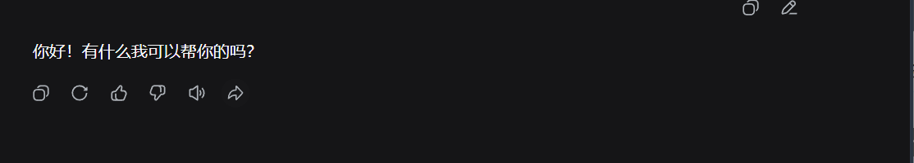

# DeepSeek 朗读解锁（浏览器插件）

> Unlock the official **Read aloud (TTS)** button on `chat.deepseek.com` for accounts outside the grey release.
> Chrome / Edge MV3 extension · only flips a local client-side flag · talks to the official API with your own account.
>
> 🎬 演示视频（B 站）：https://www.bilibili.com/video/BV1bxYo6tELF/

让**没有被灰度到「朗读 / TTS」的 DeepSeek 网页版账号**也能用上官方朗读功能。


原理一句话：官方判断「要不要显示朗读按钮」只读本地缓存的远程配置
`localStorage["__ds_remote_feature_store_model"].entries.model_configs.value[].tts_feature`，
而服务端接口本身对普通登录账号是放行的（实测：未灰度账号同样能取 TTS 票据、拿到 4 个音色、
成功合成音频）。插件在页面脚本之前注入，只在**读取**配置时把 `tts_feature` 补成真值，
并把 `remoteVersion` 在内存里 +1 挡住服务端覆盖；官方播放器、音色、断线续传全部照常走官方实现。



实测情况（2026-09-12，一个确实没被灰度到的账号，服务端真值 `remoteVersion=81`、三个模型 `tts_feature=false`）：

- **接口侧**：`GET /api/v0/chat/tts/voices` 与 `POST /api/v0/auth/ticket {"scope":"tts"}` 都返回 `biz_code=0`；
  直连 `wss://chat.deepseek.com/api/v0/chat/tts/` 成功合成音频（`format=pcm` 24kHz 单声道、`format=opus` 均可）。
  也就是说服务端对普通登录账号是放行的，灰度只体现在前端那个开关上。
- **前端侧**：装好插件、刷新页面后，回答下方出现喇叭入口（见上图，比原来多出来的那一个就是「朗读」）。

> 关于磁盘：补丁本身只在内存里生效，但官方前端有时会把读到的那份配置回写进 localStorage
> （例如 81 变成 1081）。插件的 `setItem` 会把抬高的部分减回去，所以磁盘通常仍是官方原值；万一被回写，**卸载插件后按钮可能留到官方下次下发新版本号**。
> 想立刻恢复原样，点插件里的「清掉本地缓存并刷新（还原）」或书签②即可。


---

## 一、安装（Chrome / Edge，1 分钟）

1. 下载/拷贝整个 `deepseek-tts-unlocker` 文件夹到本机任意位置（解压后不要删）。
2. 打开扩展管理页：
   - Edge：地址栏输入 `edge://extensions`
   - Chrome：地址栏输入 `chrome://extensions`
3. 打开右下角（Chrome 是右上角）的 **开发者模式**。
4. 点 **加载已解压的扩展程序** → 选中 `deepseek-tts-unlocker` 这个文件夹。
5. 回到 `chat.deepseek.com`，**刷新一次页面**。

每条 AI 回答下面就会出现「朗读」按钮，点它就能听；设置页里也会多出「朗读音色」。
点工具栏上的插件图标可以看状态和换音色。

> 要求 Chrome / Edge 111 及以上（用到 MV3 的 `world: "MAIN"`）。现在的浏览器都满足。

## 二、不装插件也行：书签版（零安装，任何浏览器）

把下面两段分别拖到书签栏（或新建书签、把地址粘进去）：

**① 开启朗读**（在 `chat.deepseek.com` 页面点一下）

```text
javascript:(()=>{const k='__ds_remote_feature_store_model';const r=localStorage.getItem(k);if(!r)return alert('没找到配置缓存：先登录并刷新一次页面');try{const s=JSON.parse(r);const l=s.entries.model_configs.value;if(!Array.isArray(l))return alert('配置结构变了，插件版更稳');l.forEach(c=>{if(c)c.tts_feature={}});s.remoteVersion=Math.max(s.remoteVersion||0,1e9);localStorage.setItem(k,JSON.stringify(s));location.reload();}catch(e){alert('失败：'+e);}})();
```

**② 还原**

```text
javascript:(()=>{localStorage.removeItem('__ds_remote_feature_store_model');location.reload();})();
```

书签版的代价：它把版本号顶到很大，会**冻结远程配置更新**（官方新模型/新功能可能不下发），
想恢复就点②。插件版没有这个副作用（磁盘上永远保留官方原值）。

> 提示：Chrome/Edge 首次粘贴 `javascript:` 开头的书签可能会自动去掉 `javascript:`，
> 手打一遍前缀即可；或者先在任意页面搜索一下"bookmarklet"，把地址改回去。

## 三、插件做了什么

| 文件 | 作用 |
|---|---|
| `inject.js` | 主世界、`document_start` 注入，包一层 `Storage.prototype.getItem`：读到配置缓存时给每个模型补 `tts_feature`，并把 `remoteVersion` 在内存里抬高 1000 挡住服务端覆盖；`setItem` 里再减回去，磁盘保持官方原值。 |
| `bridge.js` | 隔离世界脚本，读同源 `localStorage.userToken`，代弹窗调用 `/api/v0/chat/tts/voices`、`/api/v0/chat/tts/voice`、`/api/v0/auth/ticket`。 |
| `popup.html/js` | 状态面板：注入是否生效、账号本来有没有被灰度到、切换朗读音色。 |

只用到一个权限：`https://chat.deepseek.com/*`。不发任何外部请求，不收集数据。

## 四、卸载 / 还原

- 卸载：扩展管理页里「移除」，或关掉开发者模式。
- **卸载前建议先点一次插件里的「清掉本地缓存并刷新（还原）」**，把前端可能回写的那份补丁配置清掉；
  不点也行，官方下次下发新配置版本号时会自动恢复。
- 书签版还原：点书签②。

## 五、已知边界

- 「朗读」读的是**会话里已有的消息**：请求只带 `chat_session_id + message_id`，正文由服务端取。
  所以入口是每条回答下的小喇叭，不能让它读任意一段你自己粘的文本。
- 网页端只有「朗读」，没有 App 的语音对话（协议里 `mode` 恒为 `manual`）。
- 音色语言表不同：贝壳/白浪支持 29 种语言，海星/暗潮只支持中英日韩等 10 种；
  撞语言不支持时会提示「当前语言暂不支持朗读，可尝试切换音色」。
- `ticket` 是一次性的、600 秒有效；官方前端每轮连接都重新取票，插件不碰这部分。
- 这是灰测功能的接口，官方随时可能改协议或加服务端校验；届时插件可能需要更新。

## 六、音色对照（实测）

| voice_id | 中文名 | 性别 | 描述 | 语言 |
|---|---|---|---|---|
| `mira` | 贝壳 | 女 | 百变活泼（默认） | 29 种 |
| `echo` | 白浪 | 男 | 明朗坚定 | 29 种 |
| `stella` | 海星 | 女 | 俏皮甜美 | 10 种 |
| `tide` | 暗潮 | 男 | 低沉浑厚 | 10 种 |

官方音色试听（公开 CDN，不登录也能听）：
`https://cdn.deepseek.com/chat/tts/voice-demos/mira_zh.79e34098.mp3`
（把 `mira` 换成 `echo` / `stella` / `tide`，`zh` 换成别的语言码）

## 七、免责声明

- 本项目只修改**浏览器本地**的功能开关，通过官方接口、用**你本人账号**的凭据请求；不绕过鉴权、不抓取他人数据、不代理他人流量。
- 「朗读」是官方灰度中的功能，接口和前端随时可能变更，本项目**不保证长期有效**，也不保证不被官方判定为非常规使用。
- 插件会把你的 `userToken` 留在页面上下文里用于调用官方接口（本来就在那儿），除此之外**不向外发送任何数据**。担心的话请自行审代码（一共 5 个文件、不到 200 行）。
- 使用产生的一切后果由使用者自行承担。若官方发布正式版或明确禁止，请停用本项目。

## 八、相关

- `tools/console-probe.js`：控制台版探针 + 逆向出的完整协议备忘（票据、WebSocket 帧格式、错误码、音色字段），
  想自己写脚本或排查问题时看它。


